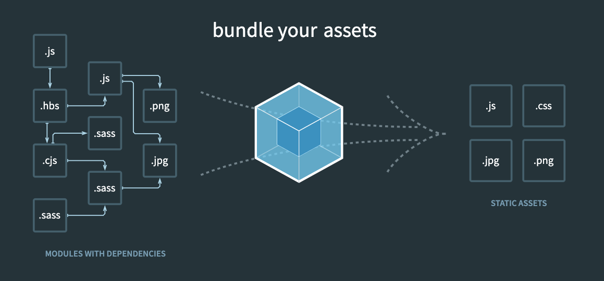

# Terminology

## ES6

ES6 (ECMAScript 6) is also known as ECMAScript 2015, which is a major version of Javascript and contains many important features.

So far, the latest version is ES11, and you can check [ECMAScript](https://en.wikipedia.org/wiki/ECMAScript) to learn more.

The syntax shipped with ES6 can make our JS code more `readable` and `maintainable`.

For example, the `template literals` makes the string manipulation more clean.

```js
/*BEFORE ES6*/
var name = 'Hello World'; 
var message = 'Hey' + name + ',';

/*ES6*/
let name = 'Hello World'; 
let message = `Hey ${name},`;
```

As you can see, the syntax is very similar with Python f-String syntax.

To know more about the modern JS syntax, please check [ES2015+ cheatsheet](https://devhints.io/es6)

## TypeScript

TypeScript is a strict syntactical superset of JavaScript and adds optional static typing to the language

```javascript
function add(left: number, right: number): number {
	return left + right;
}
```

As you can see, the syntax is very similar with Python type annotations.

Please check [TypeScript Doc](https://www.typescriptlang.org/docs/) to learn more.

## Babel

Now you understand what modern Javascript (ES6+) is, how to make the modern JS code work on some old browser?

Babel is a JavaScript transcompiler that is mainly used to **convert ECMAScript 2015+ (ES6+) code into a backwards compatible version of JavaScript that can be run by older JavaScript engines**.

## SCSS

The SCSS syntax uses the file extension `.scss`. With a few small exceptions, it’s a superset of CSS

If we write SCSS

```scss
nav {
  ul {
    margin: 0;
    padding: 0;
    list-style: none;
  }

  li { display: inline-block; }

  a {
    display: block;
    padding: 6px 12px;
    text-decoration: none;
  }
}
```

The generated css will look like this

```css
nav ul {
  margin: 0;
  padding: 0;
  list-style: none;
}
nav li {
  display: inline-block;
}
nav a {
  display: block;
  padding: 6px 12px;
  text-decoration: none;
}
```

You can check [https://sass-lang.com/guide](https://sass-lang.com/guide) to learn more about SCSS.

## Webpack

Webpack is a bundle tool, it can transform Javascript, HTML, CSS and other assets to bundle files.



For example, with proper configuration, Webpack can use relevant plugins to work with `Babel` to compile ES6 code, and use `scss`, `css-loader` to bundle css files.

## React, Vue

React and Vue are both open source frontend Javascript library for building web UI.

You can check [React doc](https://reactjs.org/docs/getting-started.html) or [Vue doc](https://vuejs.org/) to learn more.

## Alpine.js

For people who think React and Vue is heavy, you can try Alpine.js, which can let you build component directly in HTML.

The syntax of `Alpine.js` is very similar with the Vue.js, and it is easy to learn.

```html
<html>
<head>
    <script defer src="https://unpkg.com/alpinejs@3.x.x/dist/cdn.min.js"></script>
</head>
<body>
    <h1 x-data="{ message: 'I ❤️ Alpine' }" x-text="message"></h1>
</body>
</html>
```

As you can see, you can even import Alpine.js using CDN link without using any bundle solution.

You can check [Alpine.js doc](https://alpinejs.dev/start-here) to learn more.
