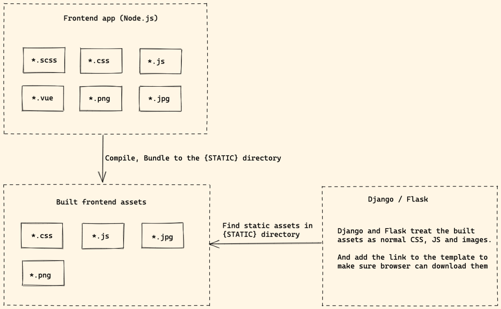
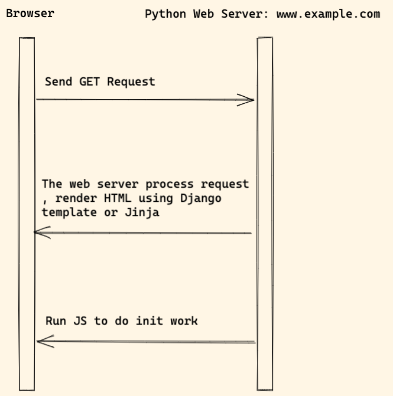

# Classic architecture

## Diagram

1. The frontend app compile and bundle frontend assets
1. After it finish building, the built assets can be found at `STATIC` directory.
1. Django or Flask will treat the built assets as normal files and **do not care where they come from**.
1. Django or Flask will add the JS and CSS link to the template to make sure browser can download them.

## Workflow

Notes:

1. When user visit the website, Python web server process the request, render HTML from using Django template or Jinja.
1. The browser download CSS, JS and other assets and render web page.

## Benefits of the modern frontend app

Some people might ask: 

1. Why not just import some JS packages using CDN link
1. Why should we import some bundle solution such as Webpack.

Because:

1. `Webpack` is the most popular bundle solution in the frontend community today, it has received 50k stars on Github.
1. It has a great ecosystem, many plugins, loaders. If we search `webpack` on npmjs.com, we can get 20k resulst.
1. If we do not need `React`, `Vue`, we can still use Webpack to help us compile `ES6`, `SCSS` and do many other things (Many people do not know that!)
1. With a proper config, Webpack can save time and let us build modern web application in quick way.

With modern frontend app, it can:

1. Linting JS, SCSS code.
1. Compile SCSS to CSS.
1. Compile and bundle JS files.
1. Watch files and auto reload web page on code change.

## Frontend

1. We can use [python-webpack-boilerplate](https://github.com/AccordBox/python-webpack-boilerplate) to jump start frontend project bundled by Webpack.
1. [Alpine.js](https://alpinejs.dev/)
1. You can also check [petite-vue](https://github.com/vuejs/petite-vue), which is 6kb subset of Vue optimized for progressive enhancement

### jQuery

jQuery is not recommended any more and below notes can help if you want to migrate to vanilla JS

1. Selecting elements with `querySelector` and `querySelectorAll`
1. Listening for events with `addEventListener`
1. Updating CSS and styles through `style` property
1. Working with classes through the `classList` property
1. AJAX requests with `fetch` or `Axios`
1. Triggering events with `dispatchEvent`
1. Creating elements with `createElement`
1. Updating text through the `textContent` property
1. Adding elements to the DOM with `appendChild`

Please write code with `ES6+` syntax to make the JS code more readable.

## Backend

If you want to load Webpack bundle file in Django or Flask:

1. [django-webpack-loader](https://github.com/django-webpack/django-webpack-loader)
1. [python-webpack-boilerplate](https://github.com/AccordBox/python-webpack-boilerplate) supports both Django and Flask.

## Pros and Cons

Pros:

1. We can still use Django / Flask template syntax and HTML as we are familiar with
1. We can write JS and SCSS in modern syntax, the code is more readable and easy to maintain.
1. We can import 3-party frontend project without touching template, but use `npm install` command
1. Code linter can help check JS and CSS code style.

## Reference

1. [Definitive Guide to Django and Webpack](https://www.accordbox.com/blog/definitive-guide-django-and-webpack/)
