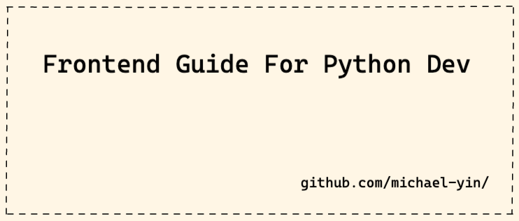

# Introduction

1. This guide is written for `Python developers`.
1. It's to help you to learn the **MODERN** frontend techs.
1. It contains details of the different architectures, you can learn and choose the correct one for your Python web project.
1. Now matter if you are using Django, Flask, FastAPI, this guide can help.
1. It is **open source**, and I wish the whole community can help improve it to help more people.
