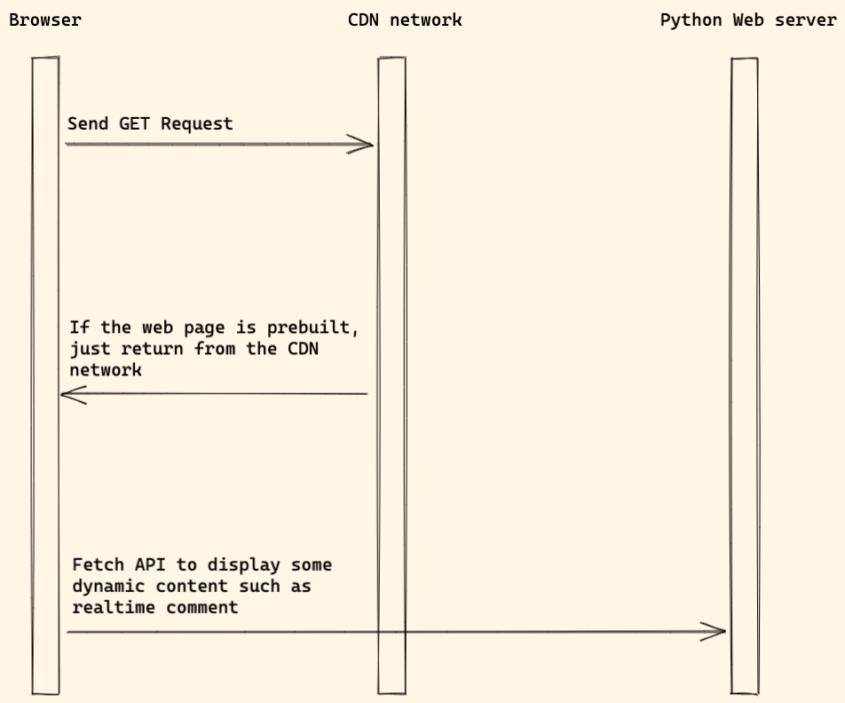

# Jamstack

> Jamstack, stands for Javascript, API and Markup (generated by a static site generator)

In the `Server side rendering` mode, we know we need to run a `Node web server` to render React or Vue component to HTML on the server side.

How about this way:

1. In the `build stage`, we try to render React or Vue component to `static HTML` (seems like `static site generate`)
1. During the `build stage`, if needed, the Node.js app also send request to the API backend to fetch data.
1. And then, deploy the built HTML to the CDN network.
1. The built app will use Javascript and API to talk to backend service, to enable dynamic content on some pages

Web app built with Jamstack is very fast (because of CDN, and the prebuilt HTML) and is very good option for many CMS application.

For example, many Wordpress applications now ues Jamstack since it is more fast and secure.

## Frontend

1. [Gatsby](https://www.gatsbyjs.com/)
1. [Next.js](https://nextjs.org/)   
1. [Nuxt.js](https://nuxtjs.org/)

It is recommended to deploy the frontend app to 

1. [Netlify](https://www.netlify.com/)
1. [Vercel](https://vercel.com/)

### Serverless Functions

If you do not understand what is `Serverless Functions`, you can learn

1. [Netlify Functions](https://functions.netlify.com/)

## Backend

### Django

For Django dev, we might also need below packages.

1. [Django REST framework](https://www.django-rest-framework.org/) which will help build REST API.
1. [dj-rest-auth](https://github.com/iMerica/dj-rest-auth) or [djoser](https://github.com/sunscrapers/djoser) for auth API support.
1. [django-cors-headers](https://github.com/adamchainz/django-cors-headers) will help solve Cross-Origin Resource Sharing (CORS) issue.
1. [graphene-django](https://github.com/graphql-python/graphene-django) Integrate GraphQL into your Django project.

### Flask

For Flask dev, we might also need below packages.

1. [flask-restful](https://github.com/flask-restful/flask-restful)
1. [flask-api](https://github.com/flask-api/flask-api)
1. [flask-graphql](https://github.com/graphql-python/flask-graphql)
1. [flask-cors](https://github.com/corydolphin/flask-cors)

### FastAPI

1. [CORSMiddleware](https://fastapi.tiangolo.com/tutorial/cors/)

## Reference

1. [jamstack homepage](https://jamstack.org/)

## Demo

[Next.js Django Demo](https://nextjs-wagtail.accordbox.com/)
