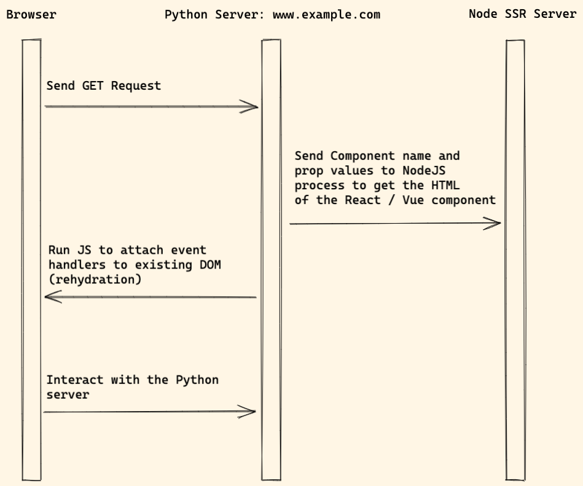

# SSR service

This pattern is to solve the SEO problem of the [Launch React or Vue in template](react_vue_template.md)

## Workflow

Notes:

1. When user visits the website, Python web server process the request
1. If the template contains React / Vue component, send request to the `Node.js` process to get the HTML of the React / Vue component
1. After that, the final HTML will be returned to the browser.
1. The browser will run JS and attach the event hanlders to the existing DOM elements. This also called [rehydration](https://en.wikipedia.org/wiki/Hydration_(web_development))

## Packages

1. [django-react-templatetags](https://github.com/Frojd/django-react-templatetags)
1. [hypernova](https://github.com/airbnb/hypernova) will run as a service, which generate HTML of the React / Vue component (server side rendering)

## Pros and Cons

Pros:

1. It is very flexible and SEO-friendly.

Cons:

1. This architecture is not very popular, and there are not many learning resources.

## Demo

[Django React SSR Demo](http://react-wagtail-ssr-app.accordbox.com/)
