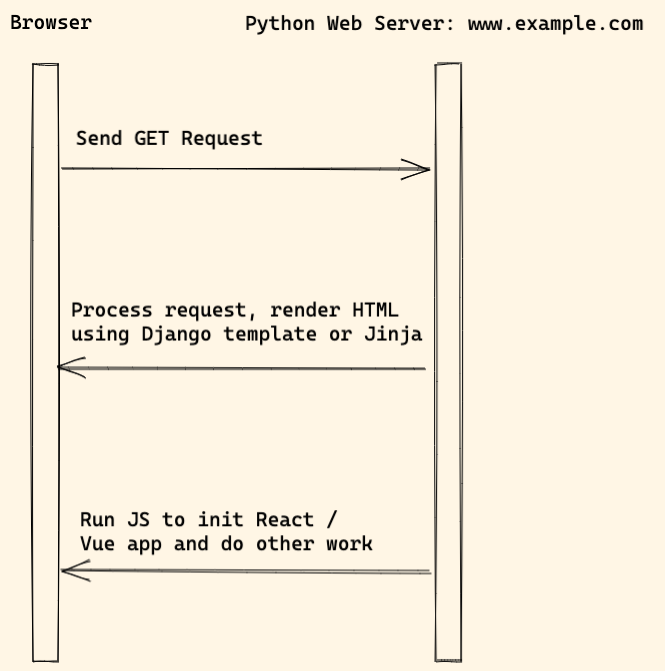

# Launch React or Vue in template

## Use case

Let's say you are building a Django project, for some reason, you need to add a complex dashboard page to the project. `React` or `Vue` seems good option here, however, **you do not want to move the whole project to `SPA`**, now this pattern can help you.

**You can use `React` or `Vue` to render the specific pages or specific components in your python web project.**

## Workflow

Notes:

1. When user visit the website, Python web server process the request, render HTML.
1. The browser download JS, run it to init React or Vue app

## Frontend

1. We can create django-react project from [django-react-boilerplate](https://github.com/vintasoftware/django-react-boilerplate)
1. Or we can add React/Vue to the Webpack boilerplate ([python-webpack-boilerplate](https://python-webpack-boilerplate.readthedocs.io/en/latest/react/)), and then load the frontend app in Django template using the custom template tag.

## Pros and Cons

Pros:

1. We can develop in `hybrid` mode, for example, we can use `React` or `Vue.js` to build some complex components, and write other parts still using Django template or Jinja.
1. Can still use some features such as form, built-auth.

Cons

1. The component rendered by React or Vue is not SEO friendly (same problem as `SPA`)
