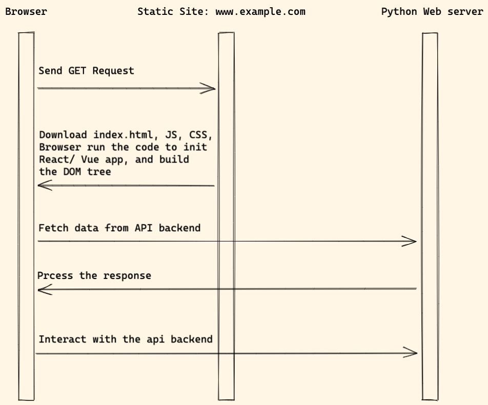

# SPA (single-page application)

> A single-page application (SPA) is a web application or website that interacts with the user by dynamically rewriting the current web page with new data from the web server, instead of the default method of a web browser loading entire new pages.

## Workflow

1. The frontend app is a static website which served by Nginx or other web server.
1. When user visit the website, `index.html` is served and browser download JS, CSS files.
1. The browser will then use the JS to init React / Vue app and build DOM tree.
1. And then React / Vue app will interact with API backend through `REST API` or `GraphQL` protocol.

## Frontend

1. We can use [create-react-app](https://github.com/facebook/create-react-app) to create a React application.
1. We can use [vue-cli](https://github.com/vuejs/vue-cli) to create Vue application.

## Backend

### Django

For Django dev, we might also need below packages.

1. [Django REST framework](https://www.django-rest-framework.org/) which will help build REST API.
1. [dj-rest-auth](https://github.com/iMerica/dj-rest-auth) or [djoser](https://github.com/sunscrapers/djoser) for auth API support.
1. [django-cors-headers](https://github.com/adamchainz/django-cors-headers) will help solve Cross-Origin Resource Sharing (CORS) issue.
1. [graphene-django](https://github.com/graphql-python/graphene-django) Integrate GraphQL into your Django project.

### Flask

For Flask dev, we might also need below packages.

1. [flask-restful](https://github.com/flask-restful/flask-restful)
1. [flask-api](https://github.com/flask-api/flask-api)
1. [flask-graphql](https://github.com/graphql-python/flask-graphql)
1. [flask-cors](https://github.com/corydolphin/flask-cors)

### FastAPI

1. [CORSMiddleware](https://fastapi.tiangolo.com/tutorial/cors/)

## Pros and Cons

Pros:

1. Friendly to both frontend and backend developers, and there are many learning resources online about this architecture.
1. The decoupled structure is clean, easy to understand.

Cons:

1. Can not benefit from some awesome Django, Flask features (templates, form, built-auth)
1. **The web application is not SEO friendly and is a little slow on first page load.**

## References

1. [Wikipedia: Single-page application](https://en.wikipedia.org/wiki/Single-page_application)

## Demo

[React Django SPA Demo](http://react-wagtail.accordbox.com/)
