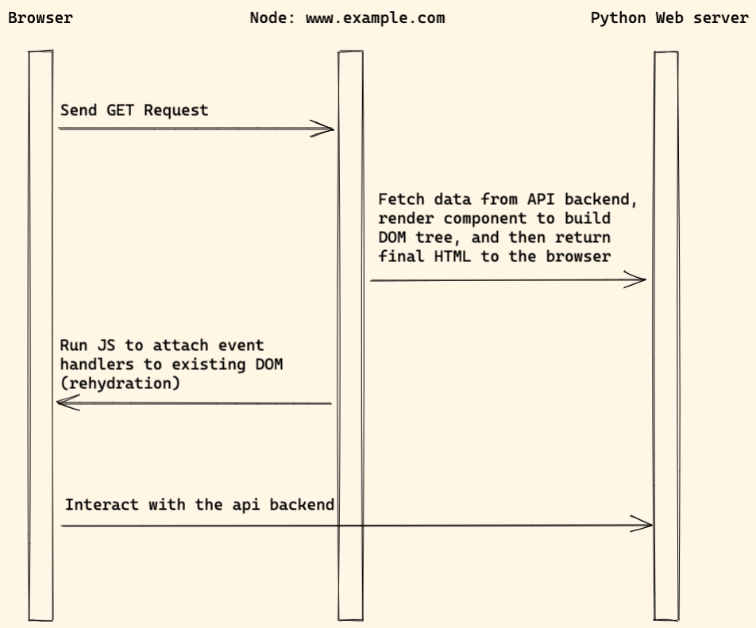

# SSR (server-side-rendering)

## Background

Let's first check why SSR is introduced and what problem it solves.

If you create web app with `SPA` pattern, check the HTML source code, you will see something like this:

```html
<html lang="en">
<head>
  <link href="/static/css/main.caf06914.chunk.css" rel="stylesheet">
</head>
<body>
<div id="root"></div>
   <script src="/static/js/2.20b865e0.chunk.js"></script>
   <script src="/static/js/main.ed646a45.chunk.js"></script>
</body>
</html>
```

We notice some problems here:

1. The above `<div id="root"></div>` is empty, the search engine can not understand what the page is about without running the JS.
1. The browser need to run some JS code to build the DOM tree (might need to send some extra requests), which make the web page is a little slow to load.

## Workflow

> Server-side rendering (SSR) is a popular technique for rendering a client-side single page application (SPA) on the server and then sending a fully rendered page to the client. This allows for dynamic components to be served as static HTML markup.



Notes:

1. When user visit the website, `Node web server` try to render component to HTML on the server side.
1. The `Node web server` will send request to the api backend to fetch `dynamic content`
1. After that, the HTML will be returned to the browser.
1. The browser will run JS and attach the event handlers to the existing DOM elements. This also called [rehydration](https://en.wikipedia.org/wiki/Hydration_(web_development))

## Frontend

1. We can use [create-next-app](https://nextjs.org/docs/api-reference/create-next-app) to create a Next.js application (React).
1. We can use [create-nuxt-app](https://nuxtjs.org/docs/2.x/get-started/installation/) to create Nuxt.js application (Vue).

## Backend

### Django

For Django dev, we might also need below packages.

1. [Django REST framework](https://www.django-rest-framework.org/) which will help build REST API.
1. [dj-rest-auth](https://github.com/iMerica/dj-rest-auth) or [djoser](https://github.com/sunscrapers/djoser) for auth API support.
1. [django-cors-headers](https://github.com/adamchainz/django-cors-headers) will help solve Cross-Origin Resource Sharing (CORS) issue.
1. [graphene-django](https://github.com/graphql-python/graphene-django) Integrate GraphQL into your Django project.

### Flask

For Flask dev, we might also need below packages.

1. [flask-restful](https://github.com/flask-restful/flask-restful)
1. [flask-api](https://github.com/flask-api/flask-api)
1. [flask-graphql](https://github.com/graphql-python/flask-graphql)
1. [flask-cors](https://github.com/corydolphin/flask-cors)

### FastAPI

1. [CORSMiddleware](https://fastapi.tiangolo.com/tutorial/cors/)

## Pros and Cons

Pros:

1. Good performance (First Paint (FP) and First Contentful Paint (FCP))
1. The web app supports SEO very well.

Cons:

1. Can not benefit from some awesome Django, Flask features (templates, form, built-auth)

## Resources

* [Rendering on the Web](https://developers.google.com/web/updates/2019/02/rendering-on-the-web)
